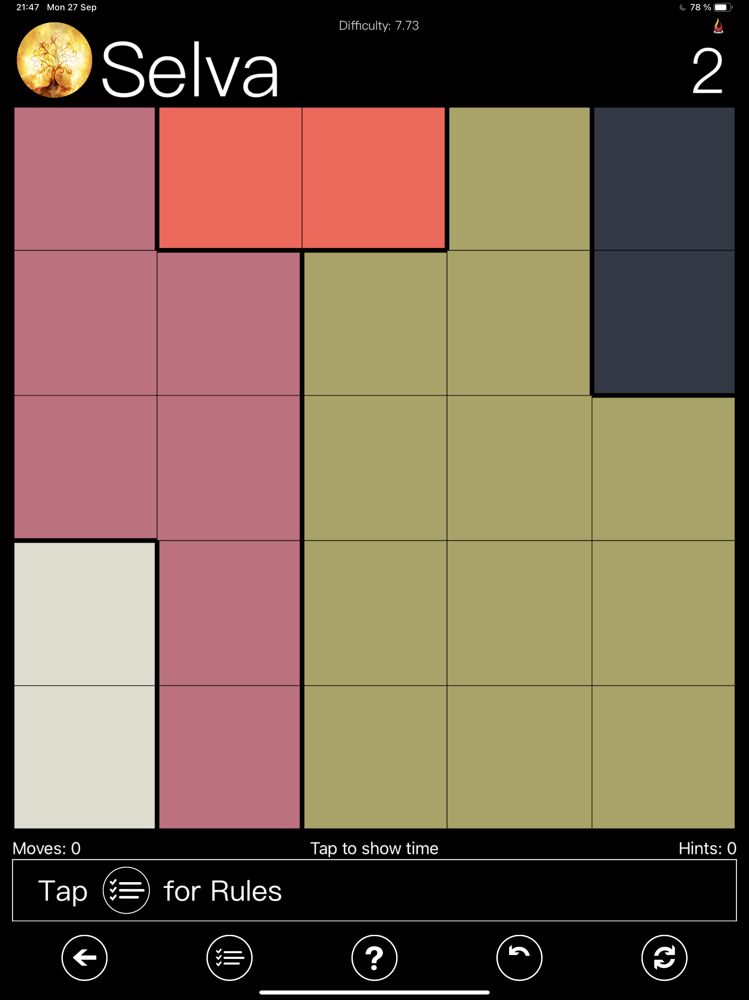

# Parks

Solver for **Parks** logic game.

## Rules

In **Parks** there are differently coloured areas called - each of them represents a **park**.
The goal of the game is to plan **trees** following the rules:

1. Put exactly one **tree** in each **park**, row and column. 
2. The **tree** cannot touch another **tree**.

## Solver 

### Data

We exported the image data from the [Parks ∞ Cantica](http://www.andreasabbatini.com/LogicGames.aspx) application for iOS.

The data is located in the `data` directory.

### Data processing

We use `openCV` library for image preprocessing in order to extract the board representing **parks**.

### Solver

* *brute force* solution - `parks_solver_brute_force.ipynb`

